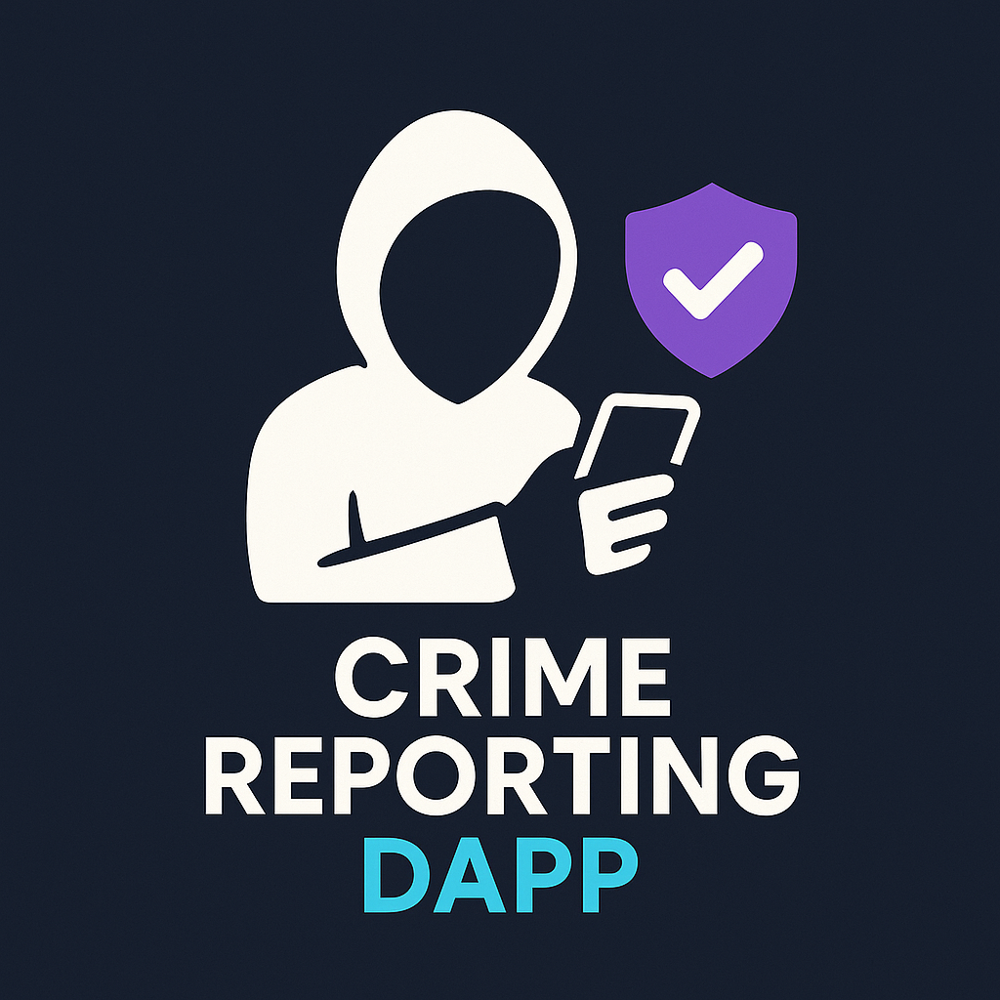
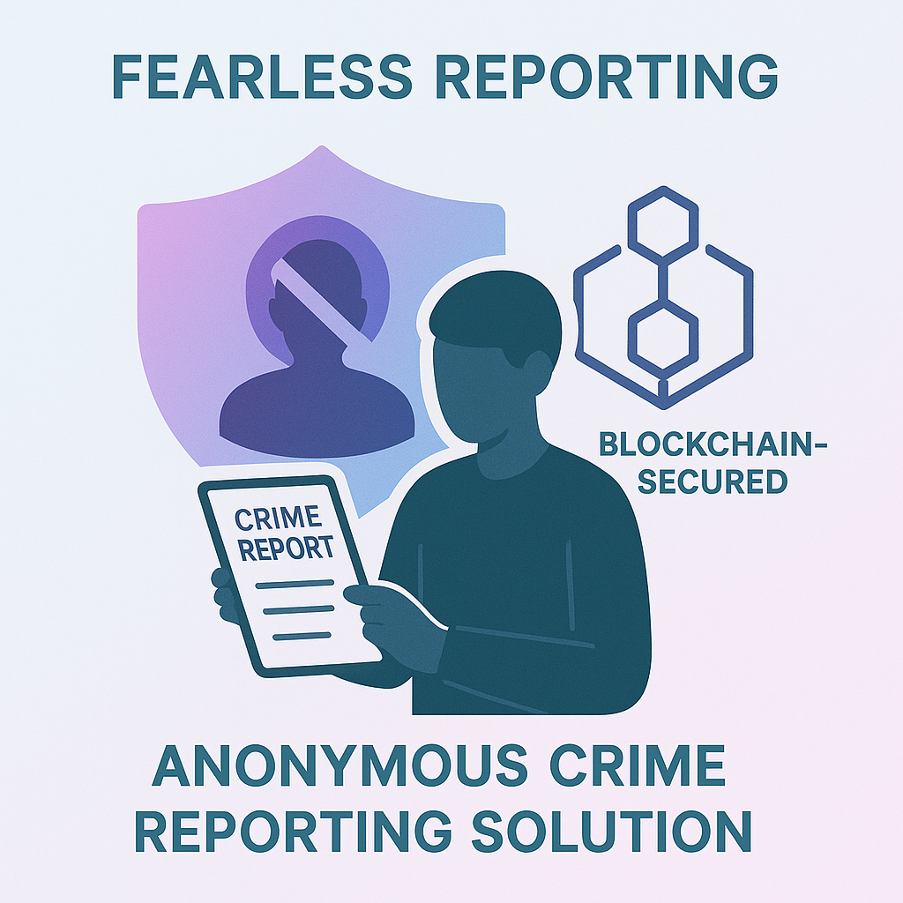

# Crime Reporting DApp

## 🔍 Vision

**Crime Reporting Dapp** aims to revolutionize crime reporting by leveraging blockchain technology to create a secure, anonymous platform where citizens can report crimes without fear of revealing their identity. Our mission is to increase crime reporting rates by removing the primary barrier - fear of retaliation or involvement.

## 🌟 The Problem

Many crimes go unreported because witnesses and victims fear:
- Personal identification leading to retaliation
- Getting entangled in lengthy legal procedures
- Exposure to public scrutiny
- Lack of trust in traditional reporting systems

## 💡 Our Solution

A decentralized application built on the Ethereum blockchain that:
- Enables **completely anonymous** crime reporting
- Stores reports securely and immutably on the blockchain
- Connects directly with authorized law enforcement personnel
- Provides a transparent yet private channel for civic duty

## ✨ Key Features

- **Anonymous Reporting**: Submit crime reports without revealing your identity
- **Blockchain Security**: All reports are secured using Ethereum blockchain technology
- **Multiple Crime Categories**: Report various types of crimes including theft, assault, vandalism, murder, and fraud
- **Severity Classification**: Indicate the urgency of the reported crime
- **User Dashboard**: Track your submitted reports and their status
- **Admin Panel**: Law enforcement can review and respond to reports
- **Interactive Chatbot**: Get instant answers to common questions
- **MetaMask Integration**: Simple login process with digital wallet

## 🛠️ Technology

- Ethereum Blockchain
- Smart Contracts
- React.js
- MetaMask Authentication
- Decentralized Storage

## 🔄 How It Works

1. **Connect Wallet**: Users connect their MetaMask wallet to the platform
2. **Submit Report**: Fill out the crime report form with details like type, location, description, and severity
3. **Blockchain Storage**: Report is anonymously stored on the blockchain with a timestamp
4. **Official Review**: Law enforcement reviews the report and adds remarks
5. **Status Update**: Users can track the status of their reports

## 🌐 Social Impact

- **Increased Reporting Rates**: By removing the fear of identification, we hope to increase crime reporting rates
- **More Effective Law Enforcement**: With more information, police can better allocate resources
- **Safer Communities**: Communities benefit from improved crime detection and prevention
- **Empowered Citizens**: Provides a way for citizens to contribute to public safety without risk

## 🔒 Privacy & Security

- Your wallet address is the only identifier used in the system
- No personal information is required or stored
- Reports are securely stored on the immutable Ethereum blockchain
- Only authorized law enforcement officials can access the admin dashboard

## 📝 Project Status

This project is currently in beta testing. We are continuously improving the platform based on user feedback and preparing for eventual mainnet deployment.

## 📜 License

This project is licensed under the MIT License - see the [LICENSE](LICENSE) file for details.

---

*Built with ❤️ for safer communities through anonymous crime reporting*